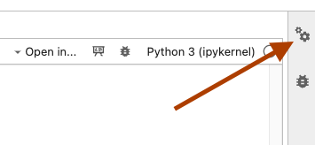
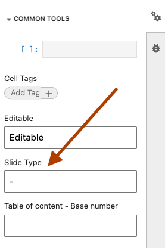
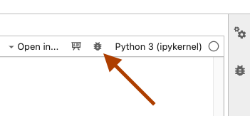
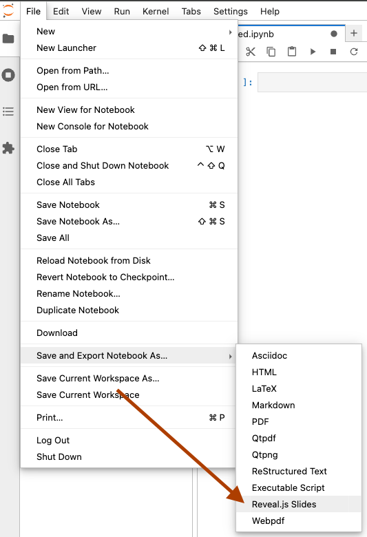

# Jupyter Notebooks

This repo contains all needed to get jupyter lab running locally with some common data science and plotting packages pre-installed.

## Development Setup

Build and start the container with

```shell
dc up -d
```

Access the notebooks at [http://localhost:8888](http://localhost:8888)

Exec into the service with

```shell
dc exec jupyter /bin/bash
```

## Slides

If you want to generate presentations from a jupyter notebook, first you need to set the slide type for each cell. To do that, click on the Common Tools gear icon in the top-right



Then, set the cell type using to the Slide Type dropdown box



Once you have set all the cell slide types, you can preview the slides in jupyter lab by clicking the Slides button



Or if you want to export the notebook into an HTML presentation, either export directly from jupyter lab



or use the CLI commands below.

### Presentation Mode

During a presentation, know the following keyboard shortcuts:

- `Esc` or 'O": Slide overview
- `S`: Speaker notes view
- `?`: See all keyboard shortcuts

### Export as HTML Slides

Run the following command to generate slides including code blocks:

```shell
jupyter nbconvert --to slides notebooks/presentation.ipynb
```

If you want to serve the presentation immediately after conversion, run

```shell
jupyter nbconvert --to slides --post serve notebooks/presentation.ipynb
```

If you want to exclude code blocks from the slides (only see the output of cells), run

```shell
jupyter nbconvert --to slides --no-input notebooks/presentation.ipynb
```

### Export the HTML Slides as PDF

Open the HTLM slides in **Safari** (this trick does not work in Chrome as of 2/1/2024)

Append `?print-pdf` to the end of the url. Remove `#/` before appending

Press ctrl-P, change layout to landscape, set margins to none, then click Save as PDF

### Export as PDF

Exporting as a PDF using nbconvert does not take into account the "Slide Type" setting for each cell. Every cell will be included in the output PDF. It is still possible to exclude input code cells and only show output cells by adding `--no-input` to the cli command.

This looks very nice for generating more technical documents. All  notebook markdown fields will be displayed. Can tell a good technical story this way!

To enable exporting as as PDF, install host-level PDF-related dependencies with

```shell
brew install pandoc basictex
eval "$(/usr/libexec/path_helper)"
export PATH="$PATH:/Library/TeX/texbin/"
sudo tlmgr update --self
sudo tlmgr install texliveonfly
sudo tlmgr install adjustbox
sudo tlmgr install tcolorbox
sudo tlmgr install collectbox
sudo tlmgr install ucs
sudo tlmgr install environ
sudo tlmgr install trimspaces
sudo tlmgr install titling
sudo tlmgr install enumitem
sudo tlmgr install rsfs
sudo tlmgr install pdfcol
```

To output as a PDF document, run

```shell
jupyter nbconvert --to pdf notebooks/presentation.ipynb
```

To output as a PDF document and exclude input cells, run

```shell
jupyter nbconvert --to pdf --no-input notebooks/presentation.ipynb
```

#### PDF Troubleshooting

If you are having issues converting to a PDF, try converting to latex first

```shell
jupyter nbconvert --to latex notebooks/presentation.ipynb
```

and then manually convert to PDF with

```shell
xelatex filename.tex
```

Hopefully you'll see errors related to missing packages which you can then install with `sudo tlmgr install $MISSING_PACKAGE`

## Extensions

### JupySQL

[Repo](https://github.com/ploomber/jupysql)

[Documentation](https://jupysql.ploomber.io/en/latest/quick-start.html)

For running SQL in Jupyter notebooks via %sql and %%sql magics

### Rise

[Repo](https://github.com/jupyterlab-contrib/rise)

Reveal.js slideshow extension
